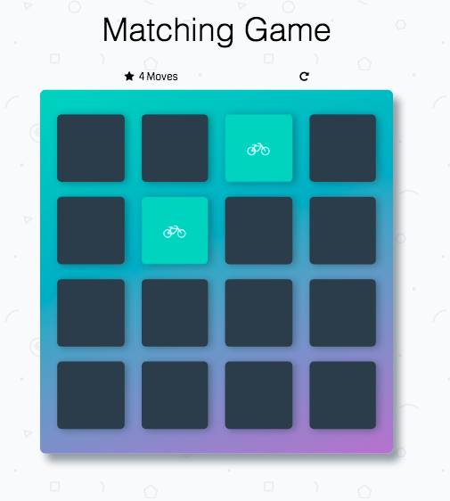

# Memory Game Project

For this project, I am building a Match Game.
The starter project has some HTML and CSS styling to display a static version of the Memory Game project. 

I am turning the static version to an interactive one modifying the HTML and CSS files, but primarily the JavaScript file.

Please click [here](https://portfolio-bamby.netlify.com/) to be redirected to the website. 

# Technologies

* HMTL
* CSS
* JAVASCRIPT

# Launch

 The project does not have minimum hardware requirements.
 Just view the HTML Page in Your Browser.
 Please click [here](https://portfolio-bamby.netlify.com/) to be redirected to the website.

 # Contributing 

This project was written by Bamby Gassama inspired by Udacity Nanodegree 2nd project assignment. 

# Licence
The MIT License (MIT)

Copyright (c) 2019 Bamby Gassama

Permission is hereby granted, free of charge, to any person obtaining a copy
of this software and associated documentation files (the "Software"), to deal
in the Software without restriction, including without limitation the rights
to use, copy, modify, merge, publish, distribute, sublicense, and/or sell
copies of the Software, and to permit persons to whom the Software is
furnished to do so, subject to the following conditions:

The above copyright notice and this permission notice shall be included in all
copies or substantial portions of the Software.

THE SOFTWARE IS PROVIDED "AS IS", WITHOUT WARRANTY OF ANY KIND, EXPRESS OR
IMPLIED, INCLUDING BUT NOT LIMITED TO THE WARRANTIES OF MERCHANTABILITY,
FITNESS FOR A PARTICULAR PURPOSE AND NONINFRINGEMENT. IN NO EVENT SHALL THE
AUTHORS OR COPYRIGHT HOLDERS BE LIABLE FOR ANY CLAIM, DAMAGES OR OTHER
LIABILITY, WHETHER IN AN ACTION OF CONTRACT, TORT OR OTHERWISE, ARISING FROM,
OUT OF OR IN CONNECTION WITH THE SOFTWARE OR THE USE OR OTHER DEALINGS IN THE
SOFTWARE.
